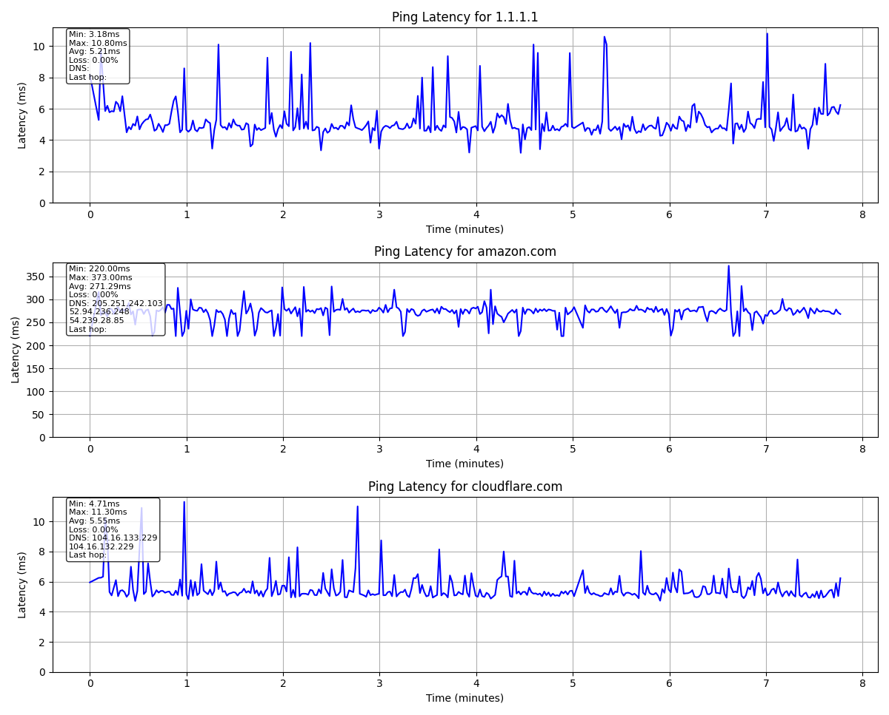

# Summary

Diagnostic home broadband test. Plots latency of continuous pings to assist with outage investigation. Also, logs created for ping, dns and traceroute.



# Usage Reminder

```shell
$ git clone https://github.com/chrisbuckleycode/usefulscripts.git
$ cd usefulscripts/2.python/broadband-test
$ python3 -m venv .env
$ source .env/bin/activate
$ pip install -r requirements.txt
$ python3 app.py
$ deactivate
```

# Notes
- This script is intended to help diagnose occasional drop-outs on my laptop's wireless NIC with the router on my LAN.
- Developed with a lot of AI assistance to explore the potential of matplotlib graph generation and sub-process logging. Can be considered "alpha"!

# Future Ideas
- Dynamic scaling when plot becomes cluttered over time.
- Revisit logging requirements and make appropriate modifications (currently using AI suggestions, not user-friendly).
- Consider tracking/logging at the network interface level.
- Investigate OS/networking libraries that are superior to subprocesses.
