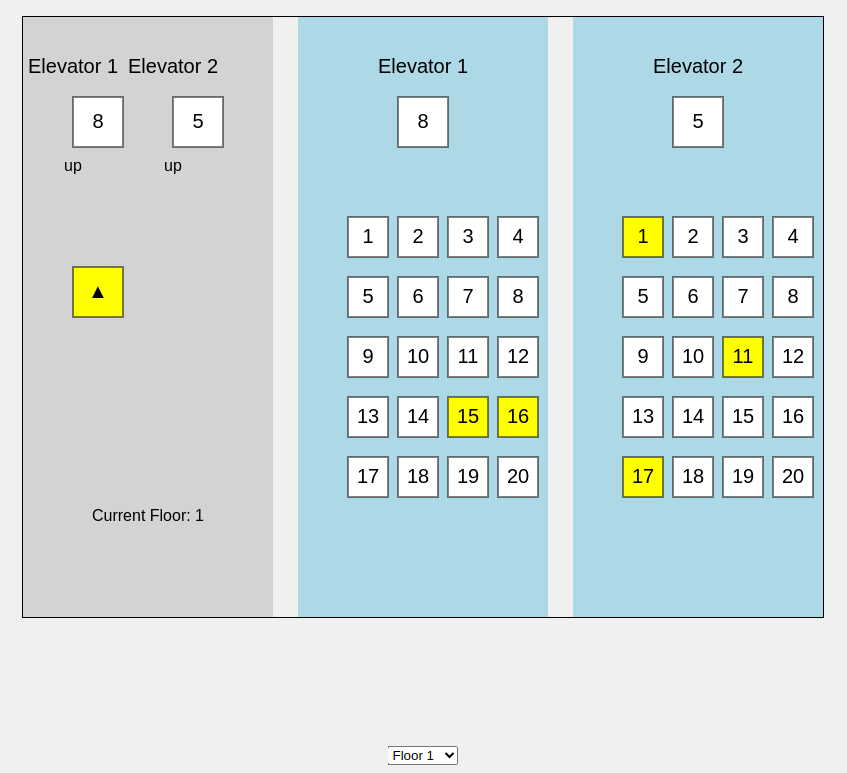

# Summary

Simulation of two elevators using Python and HTML canvas.



# Usage Reminder

```shell
$ git clone https://github.com/chrisbuckleycode/usefulscripts.git
$ cd usefulscripts/elevator-simulator
$ python3 -m venv .env
$ source .env/bin/activate
$ pip install -r requirements.txt
$ python3 app.py
# Visit http://localhost:5000
$ deactivate
```

# Notes
- Change lobby floor using the drop-down menu.
- This application was developed with a lot of AI assistance to explore the potential of limited time and capabilities (Javscript).

# Future Ideas
- Overhaul elevator logic to be more simple and robust (currently very good except for some rare, unusual edge cases).
- Change timing to account for door operations.
- Overhaul GUI
